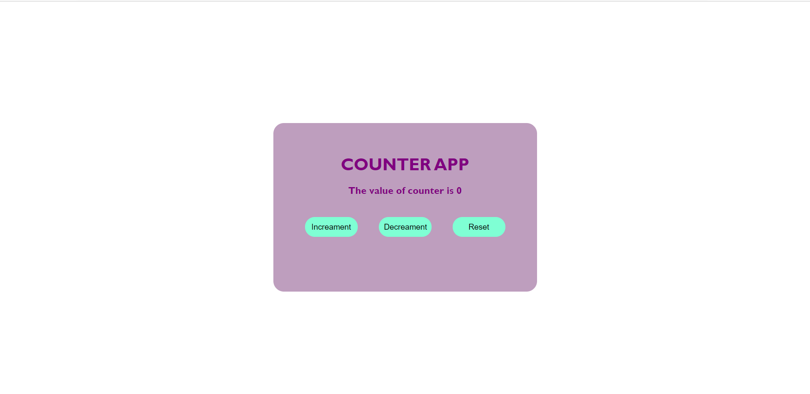

# DevSecOps-Counter-App-Deployment  [](https://github.com/yash509/DevSecOps-BB-Char-React-App-Deployment/actions/workflows/docker-image.yml)


<div align="center">


</div>


# Counter App (Simple React JS Project )
This Project is a Simple ReactJS Project which demonstrates the following
1. increamenting a counter value
2. decrementing a counter value
3. reseting a counter value.

## Prerequisites

### Install Node JS
Refer to https://nodejs.org/en/ to install nodejs

### Install create-react-app
Install create-react-app npm package globally. This will help to easily run the project and also build the source files easily. Use the following command to install create-react-app

```bash
npm install -g create-react-app
```

## Cloning and Running the Application in local

Clone the project into local

Install all the npm packages. Go into the project folder and type the following command to install all npm packages

```bash
npm install
```

In order to run the application Type the following command

```bash
npm start
```

The Application Runs on **localhost:3000**


### output 
 
